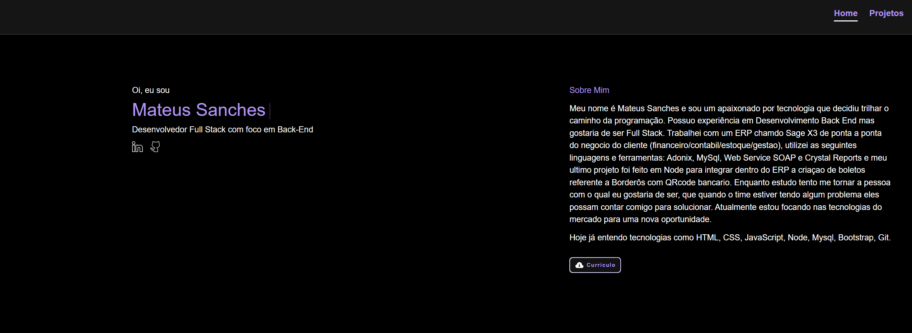

<h1><a href="https://mateussanches.vercel.app/"> Portfólio </a></h1>

  
  
  

  

<h2>:bookmark_tabs: Descrição</h2>

Meu portfólio. Aplicação criada para mostrar os projetos que ja desenvolvi e estou desenvolvendo na minha carreira.

<h2>:dollar: Licença</h2>
<b>Proibida a utilização dos arquivos para fins diferentes de aprendizado.</b>
